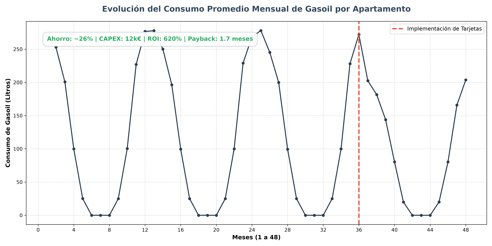

# Análisis y Optimización de Costos de Energía

## Resumen Ejecutivo

Este proyecto presenta un caso práctico de análisis de datos y modelado financiero basado en una experiencia profesional real. El objetivo central fue evaluar la viabilidad y el impacto de una medida de eficiencia energética en un complejo de 200 apartamentos turísticos situados en una zona de montaña.

El repositorio contiene el código necesario para simular perfiles de consumo de gasoil con alta estacionalidad (incluyendo anomalías de derroche documentadas en el caso real) y el script analítico que procesa estos datos para extraer métricas financieras determinantes para la toma de decisiones gerenciales.

## El Problema de Negocio

El complejo turístico experimentaba sobrecostos operativos severos durante la temporada de invierno. Una auditoría preliminar reveló que un porcentaje significativo de huéspedes dejaba los sistemas de calefacción encendidos a máxima capacidad mientras se encontraban fuera del apartamento durante el día.

Para mitigar este derroche, se propuso la instalación de **interruptores de tarjeta** en cada unidad. Esto garantizaría el corte automático del sistema de climatización en ausencia de los ocupantes, manteniendo un consumo residual mínimo por aquellos usuarios que lograsen evadir el sistema (por ejemplo, solicitando una segunda tarjeta).

### Parámetros Financieros Base
- **Precio del gasoil**: 1.15 € / litro.
- **Inversión inicial (CAPEX)**: 60 € por apartamento (Total: 12,000 €).

## Metodología y Estructura del Repositorio

El proyecto se divide en dos fases técnicas principales, estructuradas de la siguiente manera:

- `data/`: Contiene los datasets sintéticos generados.
  - `consumo_historico.csv` (36 meses de operación previa).
  - `consumo_optimizado.csv` (12 meses proyectados post-implementación).
- `src/`: Scripts ejecutables desarrollados en Python.
  - `generar_datos_consumo.py`: Simulación de series temporales con estacionalidad y distribución probabilística de anomalías.
  - `analisis_financiero.py`: Procesamiento del histórico, evaluación del impacto porcentual y cálculo de las métricas de inversión.
- `assets/`: Recursos gráficos y resultados de salida.

## Resultados y Evaluación de Inversión

El modelo analítico demuestra que la corrección del comportamiento de derroche, incluso asumiendo un margen de error (usuarios que puentean el sistema), genera un caso de negocio extraordinariamente rentable:

* **Reducción Neta de Consumo**: ~25.5%
* **CAPEX Total**: 12,000 €
* **Ahorro Operativo Anual (OPEX)**: ~86,458 €
* **Retorno de Inversión (ROI)**: 620.49%
* **Periodo de Recuperación (Payback)**: 1.7 meses

### Impacto Operativo



*La gráfica evidencia el drástico punto de inflexión en los picos de invierno tras la implementación tecnológica en el mes 36, normalizando la curva de demanda.*

## Tecnologías Utilizadas

- **Lenguaje**: Python 3
- **Librerías**: `pandas`, `numpy`, `matplotlib`
- **Técnicas**: Análisis de Series Temporales, Simulación de Datos (Montecarlo/Estocástica básica), Modelado Financiero (CAPEX/OPEX/ROI).

## Instrucciones de Uso

Para ejecutar y validar este análisis en un entorno local:

```bash
# 1. Clonar repositorio
git clone https://github.com/SimonChiabo/Analisis_Costos_Energia.git
cd Analisis_Costos_Energia

# 2. Instalar requerimientos (pandas, numpy, matplotlib)
pip install pandas numpy matplotlib

# 3. Generar la simulación de datos (output en carpeta data/)
python src/generar_datos_consumo.py

# 4. Ejecutar el modelo financiero (output en consola y carpeta assets/)
python src/analisis_financiero.py
```
