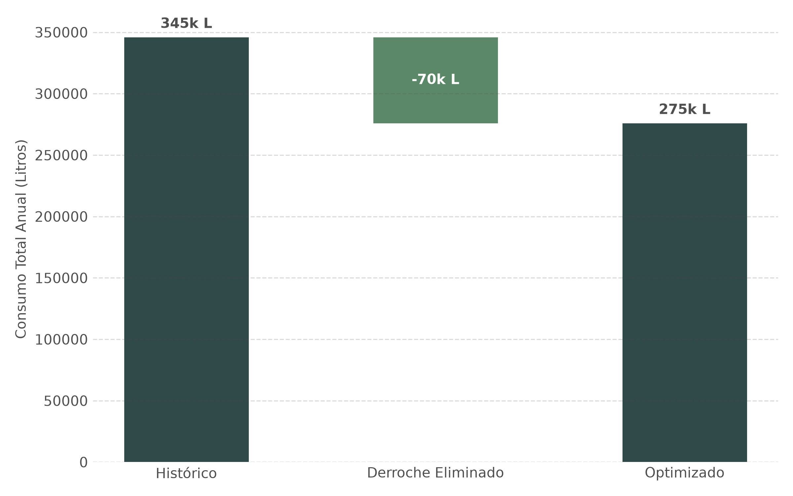
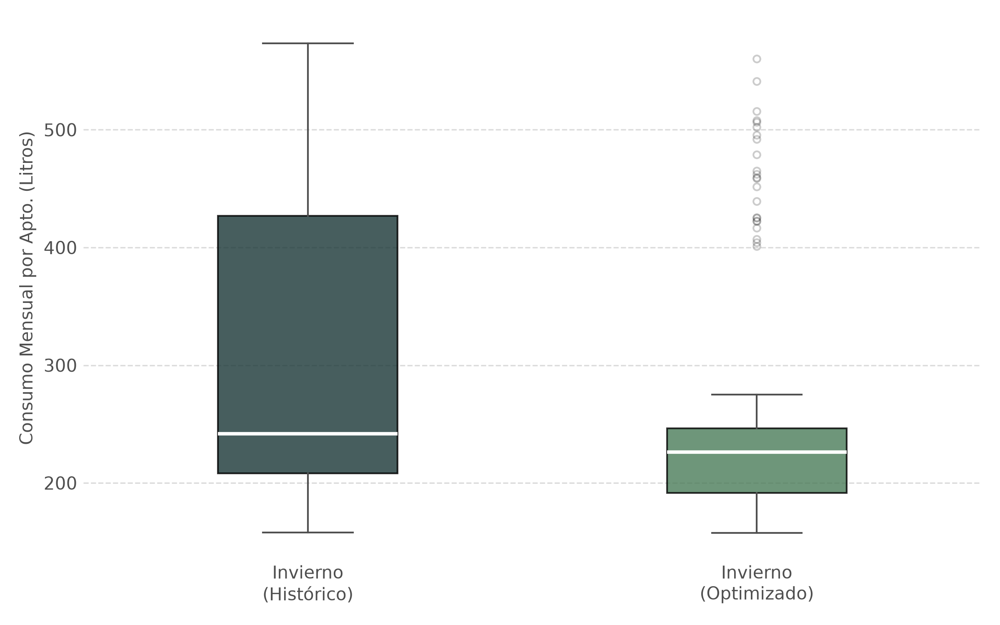

# Análisis y Optimización de Costos de Energía

## Resumen Ejecutivo

> **Nota sobre los datos:** Este proyecto reconstruye un caso real que gestioné profesionalmente. Por confidencialidad, los datos originales de la empresa no son públicos; en su lugar, generé datasets sintéticos parametrizados con los órdenes de magnitud reales observados en la operación (en particular, una reducción de ~20% en el consumo de combustible tras la intervención). Las métricas financieras de este informe se derivan de esos supuestos, no de mediciones directas sobre los datos originales.

Este proyecto presenta un caso práctico de análisis de datos y modelado financiero basado en una experiencia profesional real. El objetivo central fue evaluar la viabilidad y el impacto de una medida de eficiencia energética en un complejo de 200 apartamentos turísticos situados en una zona de montaña.

El repositorio contiene el código necesario para simular perfiles de consumo de gasoil con alta estacionalidad. El script analítico procesa estos datos simulados para extraer métricas financieras determinantes para la toma de decisiones gerenciales.

## El Problema de Negocio

El complejo turístico experimentaba sobrecostos operativos severos durante la temporada de invierno. Una auditoría preliminar reveló que un porcentaje significativo de huéspedes dejaba los sistemas de calefacción encendidos a máxima capacidad mientras se encontraban fuera del apartamento durante el día.

Para mitigar este derroche, se propuso la instalación de **interruptores de tarjeta** en cada unidad. Esto garantizaría el corte automático del sistema de climatización en ausencia de los ocupantes, manteniendo un consumo residual mínimo por aquellos usuarios que lograsen evadir el sistema (por ejemplo, solicitando una segunda tarjeta). En la operación real, tras instalar los interruptores de tarjeta se observó una reducción aproximada del 20% en el consumo de combustible. Ese valor es el que ancla la simulación.

### Parámetros Financieros Base
- **Precio del gasoil**: 1.15 € / litro.
- **Inversión inicial (CAPEX)**: 60 € por apartamento (Total: 12,000 €).

## Metodología y Estructura del Repositorio

El proyecto se divide en dos fases técnicas principales, estructuradas de la siguiente manera:

- `data/`: Contiene los datasets sintéticos generados.
  - `consumo_historico.csv` (36 meses de operación previa).
  - `consumo_optimizado.csv` (12 meses proyectados post-implementación).
- `src/`: Scripts ejecutables desarrollados en Python.
  - `generar_datos_consumo.py`: Simulación de series temporales con estacionalidad y distribución probabilística de anomalías.
  - `analisis_financiero.py`: Procesamiento del histórico, evaluación del impacto porcentual y cálculo de las métricas de inversión.
- `assets/`: Recursos gráficos y resultados de salida.

## Resultados y Evaluación de Inversión

Las siguientes cifras son el output del modelo financiero aplicado sobre los datos simulados, partiendo del ~20% de ahorro observado en campo.

El modelo analítico demuestra que la corrección del comportamiento de derroche, incluso asumiendo un margen de error (usuarios que puentean el sistema), genera un caso de negocio extraordinariamente rentable:

* **Reducción Neta de Consumo**: ~20.3%
* **CAPEX Total**: 12,000 €
* **Ahorro Operativo Anual (OPEX)**: ~80,558 €
* **Retorno de Inversión (ROI)**: 571%
* **Periodo de Recuperación (Payback)**: 1.8 meses

## Análisis de Sensibilidad

El ahorro real (~20%) es el supuesto central del modelo. Se evalúa cómo se comportan los indicadores ante escenarios más conservadores:

| Escenario de ahorro | Ahorro anual (€) | ROI | Payback |
|---------------------|------------------|-----|---------|
| Conservador (15%)   | ~ 59,650 €       | 397%| 2.4 meses |
| Base (20%)          | ~ 79,533 €       | 563%| 1.8 meses |
| Optimista (25%)     | ~ 99,416 €       | 728%| 1.4 meses |

Incluso en el escenario conservador, el payback se mantiene por debajo de unos pocos meses, lo que confirma la robustez del caso de negocio.

### Visualizaciones y Análisis de Impacto

El proyecto incluye visualizaciones avanzadas para comunicar tanto el impacto financiero macro como el control estadístico micro:

#### 1. Impacto Financiero (Waterfall Chart)

*Resumen del caso de negocio: el volumen de consumo estructural se mantiene, mientras que el derroche se elimina casi por completo tras la intervención.*

#### 2. Control de Varianza en Invierno (Box Plot)

*Análisis micro: Al aislar los meses de invierno, se observa la drástica reducción de la varianza. La intervención eliminó los "outliers" (apartamentos con picos de derroche), estandarizando el comportamiento.*

*(Ver carpeta `assets/` para gráficos adicionales generados por el script `src/generar_visualizaciones_avanzadas.py`)*

## Tecnologías Utilizadas

- **Lenguaje**: Python 3
- **Librerías**: `pandas`, `numpy`, `matplotlib`
- **Técnicas**: Análisis de Series Temporales, Simulación de Datos (Montecarlo/Estocástica básica), Modelado Financiero (CAPEX/OPEX/ROI).

## Instrucciones de Uso

Para ejecutar y validar este análisis en un entorno local:

```bash
# 1. Clonar repositorio
git clone https://github.com/SimonChiabo/Analisis_Costos_Energia.git
cd Analisis_Costos_Energia

# 2. Instalar requerimientos (pandas, numpy, matplotlib)
pip install pandas numpy matplotlib

# 3. Generar la simulación de datos (output en carpeta data/)
python src/generar_datos_consumo.py

# 4. Ejecutar el modelo financiero (output en consola y carpeta assets/)
python src/analisis_financiero.py
```
